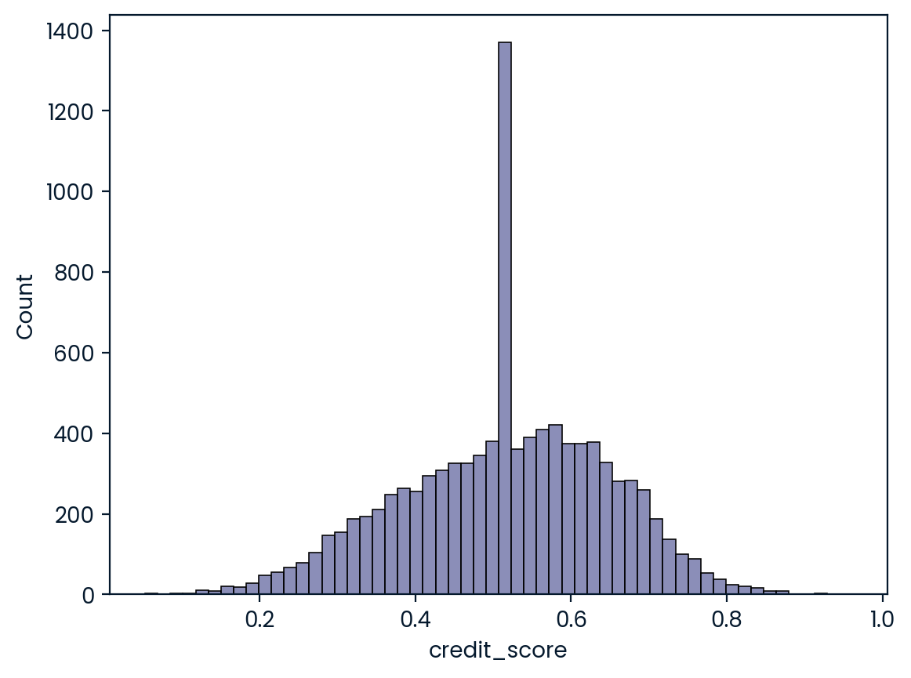
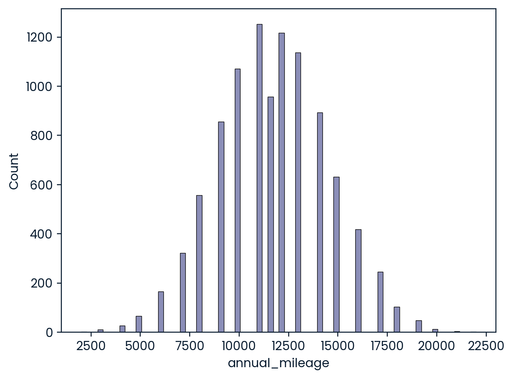

# Car Insurance Claim Prediction – One Feature at a Time

This project demonstrates a simple machine learning approach to help an insurance company identify the **most predictive single feature** for whether a customer will make a claim on their car insurance.

---

## Project Objective

On the Road Car Insurance has limited infrastructure for machine learning deployment. They want to start small — with a model based on **one input feature only** — but still gain meaningful predictive insights.

Your task:
- Build logistic regression models using one feature at a time
- Compare performance using **accuracy**
- Identify the **best feature** for future implementation

---

## Dataset

The dataset `car_insurance.csv` contains various customer attributes such as:

- Age, gender, driving experience
- Vehicle ownership, credit score, vehicle type
- Past violations and accidents
- Income, education, and more

> Missing values in `credit_score` and `annual_mileage` were filled using the column mean.

---

## Methodology

- Cleaned and preprocessed the dataset
- Built **logistic regression models** using `statsmodels` for each feature
- Used confusion matrix to manually calculate **accuracy** for each model
- Identified the **top-performing feature** based on accuracy score

---

## Result

After training a separate model for each feature, the model using:

best_feature = driving_experience
best_accuracy = 0.7771

had the highest prediction accuracy on the dataset.

> This feature is recommended as a baseline model for deployment.

---
## Key Visualizations

### Distribution of Credit Scores

---

### Distribution of Annual Mileage

